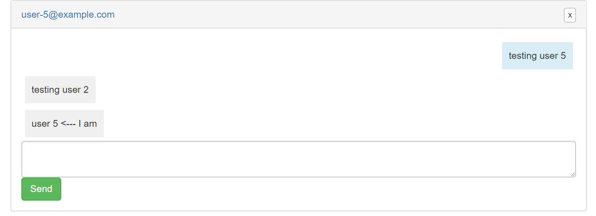

## Network Programming Assignment - Chat Appplication

You can checkout the live version of the application at https://chatting-application-actioncab.herokuapp.com/users/sign_in



## UserIDs and Creds
user-X@example.com

where x -> 1-5

Example: user-1@example.com

Password: pass123

## Requirements

1. Java - 1.8.x
2. Maven - 3.x.x

## Steps to Setup
**1. Clone the application**
```bash
git clone https://github.com/prataptryingcoding/chatting-code.git
```
**2. Build and run the app using maven**
```bash
cd spring-boot-websocket-chat-demo
mvn package
java -jar target/websocket-demo-0.0.1-SNAPSHOT.jar
```
Alternatively, you can run the app directly without packaging it like so -
```bash
mvn spring-boot:run
```
## Learn More
You can find the tutorial for this application in my submission file -
https://www.callicoder.com/spring-boot-websocket-chat-example/
